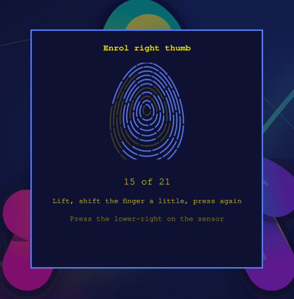
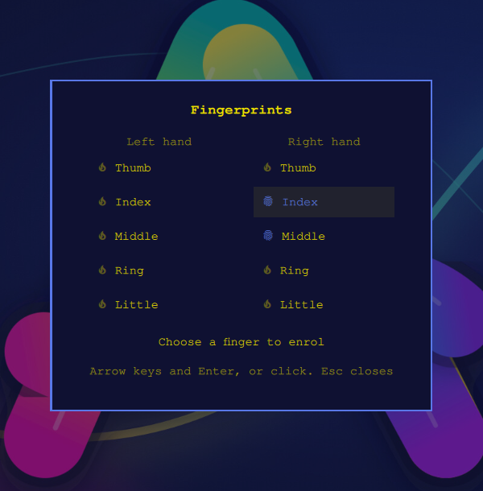

# Fingerprint login for Omarchy on a $20 USB reader

A libfprint driver for the Elan `04f3:0c3d` press sensor (sold as "TEC" and
other Windows Hello USB dongles), and a phone-style fingerprint enrolment
widget for the [Omarchy](https://omarchy.org) desktop. Together they turn a
2018 ASUS VivoBook E406MA (Pentium Silver N5000, 4 GB RAM) into a laptop
that unlocks, runs `sudo` and answers admin prompts with a touch.

<p align="center">
  
  &nbsp;
  
</p>

## What's here

| | Where | Status |
|---|---|---|
| **`elanpress` libfprint driver** for `04f3:0c3d` | [`tools/elanpress/`](tools/elanpress/README.md) | Working; installed here for sudo, polkit and the lock screen. Merge request to libfprint being prepared ([`upstream/`](tools/elanpress/upstream/MERGE-REQUEST.md)). |
| **Fingerprint enrolment overlay** for Omarchy | [`tools/omarchy-fingerprint-enroll/`](tools/omarchy-fingerprint-enroll/README.md) | Working; PR open: [omacom/omarchy#10689](https://github.com/omacom/omarchy/pull/10689). |
| **Investigation notes** | [`FINDINGS.md`](FINDINGS.md) | Why the stock driver could never work, and what was measured. |

## The problem

The dongle shows up in Linux, `fprintd` enrols it, and it never matches a
single print. libfprint's `elan` driver treats every device in its table as
a *swipe* sensor: it crops each frame to 50 rows, films ~30 frames of a
resting finger, stitches them into a strip that differs on every press, and
hands the result to NBIS, whose matcher returns a constant zero for any print
with fewer than 10 minutiae. A 3 × 4 mm patch has 1 to 5. No threshold or
fix inside that design can work; see [FINDINGS.md](FINDINGS.md).

## The driver

`elanpress` speaks the same USB protocol but treats the pad as what it is:
full 64 × 88 frames, press mode, no device-side calibration loop, up to three
distinct frames per touch, and match-on-host by normalised cross-correlation
of ridge images over translation and ±20° of rotation, spread across the
CPUs. Templates are the enrolled images.

Measured on a 140-image pool from this pad (index 20 touches; middle, ring
and thumb 12 each): the threshold sits above every impostor score (0 of 91
accepted) and passes about 60 % of genuine touches with a 20-touch
enrolment. A match returns in ~0.2 s. Coverage, not the matcher, is the
limit on a sensor this small, which is why the enrolment UI matters.

```sh
tools/elanpress/build.sh                 # libfprint master + driver, into build/
sudo tools/elanpress/hw-test.sh          # enrol + verify against the device
sudo tools/elanpress/build.sh install    # /opt/libfprint-0c3d + fprintd drop-in
omarchy setup security fingerprint       # then use it
```

Nothing on the system is replaced: the packaged libfprint stays, and only
fprintd is pointed at the new library through a systemd drop-in.

## The enrolment widget

Omarchy's fingerprint setup used to be a terminal printing "place your
finger" twenty times. On a small sensor a print only verifies when a press
overlaps something enrolled, so enrolment has to walk the finger around, and
nothing told the user that. The overlay does:

- a finger picker for both hands, enrolled fingers marked;
- a print that fills in with every accepted press and a hint for where to
  press next;
- instant "hold still" feedback the moment the sensor sees skin;
- first run: one password, then packages, enrolment, a confirm touch, and
  PAM turned on; later runs never ask for anything.

It works with any fprintd reader, not just this one.

```sh
tools/omarchy-fingerprint-enroll/install.sh     # into ~/.config/omarchy/plugins, enabled
omarchy-shell shell summon inauman.fingerprint-enroll '{}'
```

## Hardware notes

| | |
|---|---|
| Reader | TEC TE-FPA2 style dongle, USB `04f3:0c3d` Elan, firmware 0x0165, 64 × 88 px ≈ 3.2 × 4.4 mm at ~500 dpi |
| Laptop | ASUS VivoBook E406MA, Pentium Silver N5000, 4 GB, Omarchy on Arch, kernel 7.1 |
| Built-in sensor | ELAN7001 on SPI, unusable with `elanspi` on this machine; a [SIGFM press-mode patch](https://github.com/Ajaneeshwar/x571gt-fingerprint) for the same die elsewhere is the next thing to try |

## A note on biometric data

No real fingerprint captures are in this repository; they are gitignored.
The libfprint test recording under `tools/elanpress/upstream/` contains
sensor frames, but not of a fingerprint.

## Credits

Filip Spanne's [`elanpress` driver for 04f3:0c6e](https://github.com/filip-rs/libfprint),
which this driver derives from; [dragosol/fpmatch](https://github.com/dragosol/fpmatch)
for the measurements that shaped the matcher; the libfprint and Omarchy
projects.

## Licence

Driver: LGPL-2.1-or-later (libfprint's). Omarchy plugin and the rest: MIT.
See [LICENSE.md](LICENSE.md).
